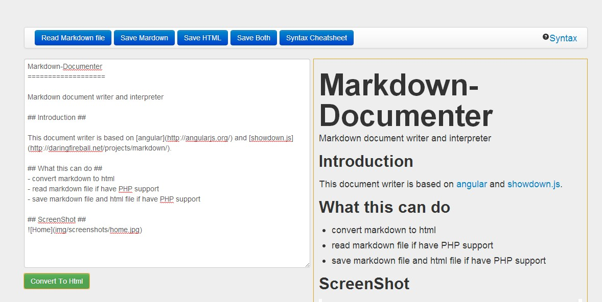

Markdown-Documenter
===================

Markdown document writer and interpreter

## Introduction ##

This document writer is based on [angular](http://angularjs.org/) and [showdown.js](http://daringfireball.net/projects/markdown/).  

## What this can do ##
- convert markdown to html
- read markdown file if have PHP support
- save markdown file and html file if have PHP support

## Before getting start ##
- you can create ``images`` folder to store images that will be used at document
- if you want to use file operation , please add ``output`` folder manully. I'm a little lazy :D

## ScreenShot ##

